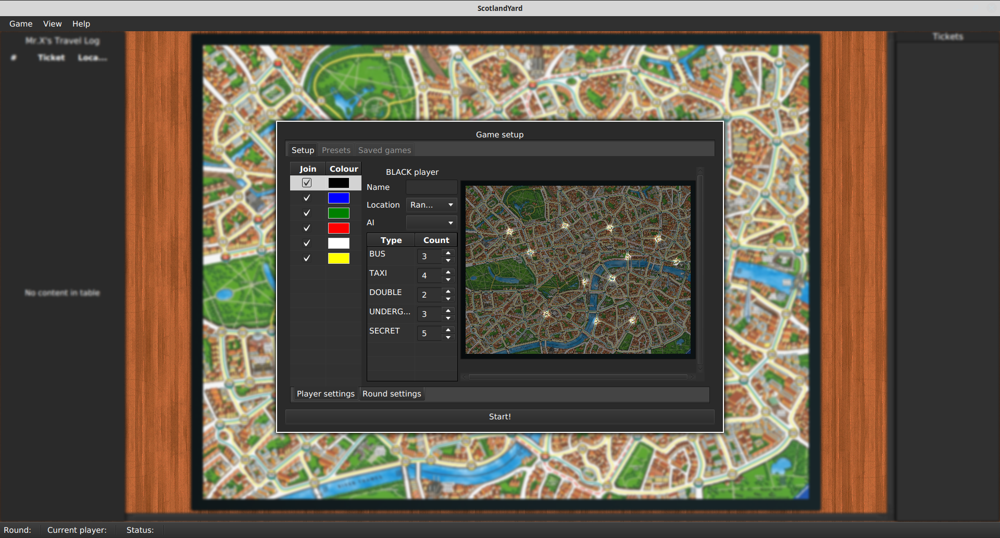

## Scotland Yard Game

### About
* Implemented the Scotland Yard Board Game using ***Java*** and ***Maven*** as a Buid system. We made use of a variety of design patterns such as Observer and Singleton.Scotland Yard is a board game in which a team of players, as police, cooperate to track down a player controlling a criminal around a board representing the streets of London, first published in 1983. 

### Prerequisites
* Before running make sure you have [JDK 8](https://adoptopenjdk.net/installation.html?variant=openjdk11&jvmVariant=hotspot#x64_win-jdk).
* Make sure you have the latest Maven installed from [here](https://maven.apache.org/install.html)

### How to Run 
* To get properly start by compiling and running the project in ```cw-model``` , type the following command when located in your main project directory:

    * ```Linux/OSX:   ./mvnw clean compile exec:java```
    * ```Windows:     mvnw clean compile exec:java```
Remember, on some systems you will be required to install Maven yourself and use mvn instead of mvnw in commands.For a guide on installing Maven look [here](https://maven.apache.org/install.html) 
.
### Testing
* There is a total of 124 JUnit tests for this application in ```src/test/java```. To run all unit tests type: 
    * ```Linux/OSX:   ./mvnw clean test```
    * ```Windows:     mvnw clean test```

### Gameplay 


